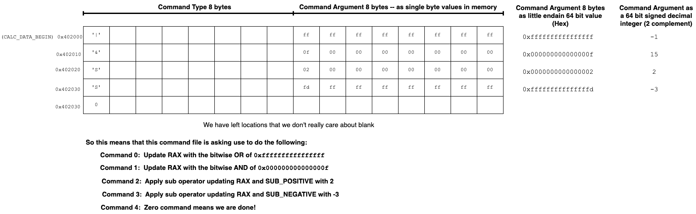

# Assembly: Writing a real program

**You may - and are encouraged to - complete this assignment in teams of two**

**Your first task with your partner should be to do a complete scan of this entire README.**

Building on our knowledge of how functions and IO work, we can now write a
more complex program in Assembly.

The program will require you to put together several of the assembly
aspects that we have been covering. Remember to use all class material to help you on this assignment.
This includes relevant lectures, discussions, and textbook chapters. 
To be successful, you will need to use gdb to explore the input data and carefully trace what your
program is doing.  You will also need to apply your knowledge of UNIX.
Finally, this is a relatively complicated program to write in assembly, so you should
heavily use git to manage your code development (We will examine your git histories 
when grading). 

**REMEMBER: Only keep source files in your repository:**
- **Do Not:** put binaries, output files, object files, etc. in your repo. 
- **Do:** put assembly source files, your Makefile, shell scripts, notes, etc in your repo

## Overview

The following is a quick overview of steps you will need to complete (details for each step are provided later in this file):
1. Convert your three fragments from the prior assignment into functions
2. Write a main routine that will iterate over and process the simple data processing language,
   invoking your three routines as needed.
3. After processing the last operation specified, your program will need to write the following binary values as output
   to standard out: the final value of `rax`, the value at `SUB_POSITIVE`, the value at `SUB_NEGATIVE` and the
   entire range of memory between `CALC_DATA_BEGIN` and `CALC_DATA_END`
4. You are required to implement the following commands: '&', '|', 'S' and 'U'
   - this means that you will have to develop a new function that implements the Upper command
5. BONUS: Add more advanced commands to your program:
   - the rest of the commands documented are bonus

## The Calc Program

Our goal is to construct a program that we will call `calc`.  The
program should be broken down into several assembly language routines.  Each
routine should be written in its own assembly (.s) file.  We will use
the assembler to translate each assembly file into its own relocatable object
file (.o).  Using the linker (ld), we will "link" together the
object files into a single executable file.  Since we will be linking in the data,
you should create a **new executable** for each data file that you want to process.

The name of each executable should be `calc_<data name>` where `<data name>` is the data the binary will contain and process.  Eg. To process the "simpleone" you would create a new "calc_simpleone" binary by linking the appropriate files together.  An example is shown below. 

### Linking and organization

We will be using the assembler to convert each of our source files into its own object file.
Then we will use the linker to create an executable by composing, linking, the object files
together.  

See [Assembly Programming as Process Address Space Image creation](https://jappavoo.github.io/UndertheCovers/lecturenotes/assembly/L14.html#assembly-programming-as-process-address-space-image-creation) for a visual example of how the linker composes multiple object files into a single binary. 

#### Symbols and addresses

This specifically involves assigning opcodes and data to specific locations in memory (addresses).  The labels we use 
in our code will thus get assigned to a particular address where the bytes we define at the label in our source code will be placed.

Eg. If we had assembly source file with the following 
```
1.     .intel_syntax noprefix
2.     .section .data 
3. myvar1: 
4.    .quad 0xdeadbeefdeadbeef
5.
6.    .section .text
7. myfunc1: 
8.    add rax, QWORD PTR [myvar1]
9.    ret
```

This file, when ran through the assembler, will create a object file that would introduce 8 bytes of data whose location can be referenced by the symbolic name `myvar1`, because of lines 3 and 4 of the source.  Similarly, it also introduces the number of bytes necessary to encode the instructions indicated, due to lines 7 to 9. The address of the first instruction can be referenced by the symbolic name `myfunc1`.  

#### Symbol resolution -- linking things up

So some lines of our source will introduce symbols and associated bytes, that will be assigned memory addresses.  Other lines of our code will "reference" these introduced symbols.  For example, the above code has one symbolic reference to the symbol `myvar1` on line 8.  When the linker processes this object file to create an executable binary file, it will assign memory addresses to the symbols.  Then, it will update any of the references with the address of the appropriate symbol -- this is called **symbol resolution**.   So in this case, the opcodes in the final binary file for the source line `add rax, QWORD PTR [myvar1]` will get updated with the address of where `myvar1` gets assigned in memory.  

#### External references

Similarly, we can have code in one object file reference symbols that are not defined within it.  Such references are called external references.

To create a final binary executable, the linker must process all the object files that will jointly form the binary image.  So when doing symbol resolution, the linker will be able to update references from one object file with the correct addresses of data or text defined in another object file.   

However, to provide the programmer some flexibility in how they organize and use symbols, the linker will resolve references across object files if the symbol was marked as `.global` in the file that defined it.  In this way, we can choose to have some symbols only resolve internally, within an object file, versus other symbols being globally visible to be linked across object files.  We some times refer to the former as "local symbols".  Specifically, the local symbols, symbols not marked as global, can only be reference within the same object file.    So if we were to add `.global myvar1` and `.global myfunc1` to the above file then we could reference these symbols in another object file.  Eg.  Lets assume we've done this and have the following second source file that we assemble into its own object file.
```
1.    .intel_syntax noprefix
2.
3.    .section .text
4. myfunc2:
5.    mov rax, 42
6.    call myfunc1
7.    mov QWORD PTR [myvar1], rax
```
Now when we link the two object files together to produce a single binary executable, the linker will update the references from this second object file to the addresses of the labels that were introduced in the first object file.   Here, line 6 is an external reference to a symbol called `myfunc1`, and line 7 is an external reference to a symbol `myvar1`.  Notice, it is not the assembler's job to worry about references.  It simply marks in the object file it creates, which symbols are defined in the object file and which are referenced but undefined. This information is held in something called the symbol table of each object file.  The symbol table lists all the global symbols defined and all symbols externally referenced. 


The following figure illustrates the above example:


For a review of the different sections we use to organize our assembly files see [Categorizing values and their Interpretation](https://jappavoo.github.io/UndertheCovers/textbook/assembly/vonNeumannArchitecture.html#categorizing-values-and-their-interpretation) and [Move Examples](https://jappavoo.github.io/UndertheCovers/lecturenotes/assembly/L09.html#move-examples).
 
## Common Errors 

Keep in mind that when using `make` to automate the assembling and linking of our code, if errors are encountered `make` will report which step caused the error. Read these messages closely to save time when debugging. Assembler errors often indicate syntax errors in your assembly code. You also may encounter Makefile errors which indicate a syntax error in the Makefile itself. Finally, linker errors are discussed in more detail below. 
 
### Link time errors 
It is not until we try and link all our object files together that we know if our code really can be sensibly put together to form a complete binary.  Eg.  there is a definition for each symbol that is referenced and that there are not multiple definitions for the same global symbol.  

If we do have such problems, the linker will not be able to link our object files together to form a final binary executable, and it will print out various linker errors such as:
1. "undefined reference"
2. "multiple definition"

Such errors are "link" time errors.  There was nothing particularly wrong with our assembly syntax -- so our code assembled.  However, in combination they did not result in object files that properly "fit" together, and we only find this out when we go to link them.  Simple spelling mistakes of symbol names and forgetting to add an object file to the link command often lead to such errors.

The code for this assignment will be split across several files and there will be various times that you need to reference symbols defined in other files.
For example, you will be developing a main routine that will use the 'call' instruction to invoke your other routines that are defined in their own files.  Eg. you will have code such as 'call sum' in your main routine.  As such you will need to ensure that such symbols are appropriately marked as `.global` in the file that defines it.

**WARNING: Having two global symbols of the same name, or two local symbols of the same name in the same file will generate an error.  However, having  local and global symbols of the same name will not!  The rules, however, can get pretty subtle and doing so often leads to painful bugs.  So our advice is do not have local symbols with the same name as a global symbol  -- keep your local names and global names unique with respect to each other.**

Remember it is not uncommon to get link time errors.  Read the error messages carefully and try and figure out what symbols are causing the problems.
Is it a reference to a symbol that you misspelled? Did you accidentally create two symbols of the same name? Did you forget to add a new .o to your link command?

**Do not include or put all of your code in one assembly file.** 

## Calculator Data

The data for your program will be specified in a `.s` file that will need to be assembled and linked into your program.
The `data` directory contains several example data files.  We also include the output
produced by our reference implementation of the calculator for each of the data files (reference_* files).  

To use a particular data file, you will need
to link the rest of your code to an object file created from the corresponding data .s file.


eg. To build and test your code with the data/simpleone_cmd.s you would need to
assemble this file and then link the resulting simpleone_cmd.o with the rest of your object files
to create your binary.  Eg.

```
$ make calc_simpleone
as -g and.s -o and.o
as -g or.s -o or.o
as -g sub.s -o sub.o
as -g upper.s -o upper.o
as -g arraysub.s -o arraysub.o
as -g listsub.s -o listsub.o
as -g array.s -o array.o
as -g list.s -o list.o
as -g atoq.s -o atoq.o
as -g calc.s -o calc.o
as -g data/simpleone_cmds.s -o data/simpleone_cmds.o
ld -g and.o or.o sub.o upper.o arraysub.o listsub.o array.o list.o atoq.o calc.o data/simpleone_cmds.o -o calc_simpleone
$ 
```

The above is from the reference implementation that supports all the commands.  So there are more source files to build.
You will want to start with just supporting the `and`, `or` and `sub` functions.
 In the data directory, `basic_cmds.s` is a simple example that only uses these.
At the start, your binary might only be built out of a 'calc.s' 'and.s', 'or.s', 'sub.s' and a data object file.

So when you are starting, building your `calc_basic` binary might look something like this:
```
$ make calc_basic
as -g and.s -o and.o
as -g or.s -o or.o
as -g sub.s -o sub.o
as -g calc.s -o calc.o
as -g data/basic_cmds.s -o data/basic_cmds.o
ld -g and.o or.o sub.o calc.o data/basic_cmds.o -o calc_basic
$ 
```

From there you can incrementally add more functions and files.

You will need to construct all the necessary files including a Makefile.

### The Data Processing

The input to your program is an area of memory that contains data.   The handout includes assembly code for example data.   Your program  will be tested with some of these.   You are encouraged to explore these
files and write your own simpler data files so that you can develop and test your code properly.

Each data file is composed of an array of "commands" and optionally some other memory values.
The commands are described below.

**We recommend you read these very carefully and understand how they should behave before trying to implement them**
```
	# Input to the "Data Processor" is an area of
	# memory that contains an array of "commands" along with potentially extra data
        # as needed.
        #
	# The start of this memory will be identified by the symbol CALC_DATA_START
	# and the end of this memory will be identified by the symbol CALC_DATA_END
	# See the data directory for example data files.
	#
	#  The first 8 bytes are the command type. Following the command  are one or more 8-byte values 
	#  that form the arguments for that command type.  The format and meaning of the arguments depends on
	#  the command type.  ASCII values are used to specify the command type.  In
	#  the following description, values in single quotes refer to the associated
	#  ascii value.
	#
	#  There are two main categories of command types: simple and complex
	#
	#
	# SIMPLE COMMANDS
	#
	#  For simple commands, the first byte of the 8-byte command will be one of:
	#    '&', '|', 'S', 'a', 'l', 'U', 'I'
	#  In these cases the remaining 7 bytes are padding and should be ignored.
	#  The next 8 bytes are the single argument to the simple command.  'a' command takes
	#  an additional 8 byte command as described below.
	#  The following describes what your program should do to process each of the simple
	#  commands:
	#
	#    '&'  :  AND: Takes one argument: update rax with the bitwise and of the
	#         :  current value of rax and the argument
	#         :  value eg.  rax = rax bitwise and with the 8-byte argument value
	#	  :
	#    '|'  :  OR: Takes one argument: same as above but apply bitwise or.
	#	  :
	#    'S'  :  SUB: Takes one argument: your sub routine should both 
	#         :       update rax by subtracting the value into rax, and update either
	#         :       the global "positive" or "negative" sub values respectively. If the argument is positive, then 
	#	  :	   add the value into "SUB_POSITIVE". If the argument is negative, then
	#	  :	   subtract the value from "SUB_NEGATIVE".
	#	  :
	#    'U'  :  UPPER: The second argument should be treated as a pointer to
	#	  : 	    an ascii string (a sequence of non-zero bytes terminated
	#	  :	    by a zero valued byte) eg 'a''b''c'0x0.   This command
	#	  :         should process the string converting lowercase letters
	#	  :	    ('a' - 'z') to their corresponding uppercase letter
	#	  :	    'A' - 'Z'.  The routine should also add the length of
	#	  :	    the string to rax. Note if the first byte of the string
	#	  :	    is zero, then the string length is 0.   The length of 
	#	  :	    'a'0x0 would be 1 and so on. 
	#	  :
	#    'a'  :  ARRAYSUB: Takes two 8-byte arguments:  First is a length, and
	#         :            the second is an 8-byte address to an array of 8-byte values.
	#         :            You should apply the sub operator to each value in the array.
	#	  :
	#    'l'  :  LISTSUB:  Takes one argument: The argument is an 8-byte address of
	#         :            a list of values.  You should iterate over the list and
	#         :            apply the sub operator to the values.  Each list element is 
	#         :            16 bytes.  The first 8 bytes is the value in the element.
	#         :            The next 8 bytes is an address that points to the next
	#         :            element in the list.  You should treat a 0 address to
	#         :            indicate the end of the list.
	#	  :
	#    'I'  : ATOQ:  The second argument should be treated as a pointer to an ascii
	#         :        string.  This string should be converted to a signed 8-byte
	#         :        value.  The converted value should be subtracted in rax and,
	#         :        like in the sub operator, the SUB_POSITIVE and SUB_NEGATIVE should
	#         :        be updated correctly.  A valid value will be composed of digits (0-9)
	#         :        and optionally be prefixed with with '-' to indicate a negative value.
	#         :        The first non-digit character (excluding a leading '-') terminates the
	#         :        value. As such you should end your conversion at that point.
	#         :        Eg. The string "-10 34" would convert -10 and you would ignore the rest
	#         :        of the string. 
	#
	# 
	# When you encounter a 0 byte as the command type you should stop processing commands.

	# COMPLEX COMMANDS
	#
	#
	#
	# 'A' :  ARRAY:  indicates that the next byte of the command type value will be one of the
	#                following simple command characters '&','|','S' or 'U'
	#     eg.  'A''&' or 'A''|' or 'A''S' or 'A''U'.  The remaining 6 bytes of the command type
	#     value should be skipped.  The array command takes two 8-byte arguments that follow the type
	#     value.  The first is a Length value and the next is the address of an Array of values.
	#     Your code needs to run the specified simple command on each 8-byte value in the Array.
	#     The length specifies the number of items in the Array
	#
	# 'L' : LIST:  Like Array, the next byte of the command type value will be one of the
	#              following simple command characters '&','|','S' or 'U'
	#     eg.  'L''&' or 'L''|' or 'L''S' or 'L''U'.  The remaining 6 bytes of the command type
	#     value should be skipped.  List command takes one 8-byte argument that follows the type value.
	#     The argument should be treated as a pointer to a "list" of arguments (if zero then the list is empty).
	#     Assuming a non-empty list your code should process
	#     each element of the list by applying the specified operator to the value in each list element.
	#     The structure of a list element is as follows:
	#       <8 byte value for operation><8 byte address of next list element>
        #     The end of the list is denoted by a 0 value for the next list element.
```

For PS4B, you only need to implement functionality for AND, OR, SUB, and UPPER. 

The other fragments are bonus. :)

## Getting started

### Step 0 - OPTIONAL, but recommended to help you explore the assignment

Create a simple binary that just links one of the simple data files, then use gdb to poke around the data area of memory so that you have a solid understanding of what the commands look like in memory

The input that your program will work on is a set of commands in memory.   This area of memory needs to be constructed as an object file from a source file.   Example source command files are in the data directory.  They have names such as `basic_cmds.s`

It is a good idea to create a simple binary that lets us explore what the commands look like in memory using gdb.  That way we can get a better understanding of what our program will need to do to process the commands.

Let's walk through how we might do this with the `data/basic_cmds.s`

#### Create an object file from a command file

Lets create `data/basic_cmds.o` from `data/basic_cmds.s`.  As always, we simply need to assemble the file with an appropriate `as` command.  Of course you will likely want to put this in your `Makefile`.

```bash
$ as -g data/basic_cmds.s -o data/basic_cmds.o
```
 
At this point we should have the new object file along with the source file in the data directory.

```bash
$ ls data/basic_*
data/basic_cmds.o  data/basic_cmds.s
```

#### Create a "dummy" binary that has the command data object file linked into it

Let's create a dummy driver that we can use to link with the `data/basic_cmds.o` so that we can create an executable that we can run and use gdb with.  All we need is something really simple eg.

```nasm
    .intel_syntax noprefix
    .text
    .global _start
_start:
    # zero out rax
    xor  rax, rax 
    # setup rbx to point to the start of the commands
    mov  rbx, OFFSET [CALC_DATA_BEGIN]
    
    # just exit
    mov rax, 60
    mov rdi, 0
    syscall
```

Let's assume we have the above in a file called `dummy.s`.  Then to build a `dummy` executable linked with our `data/basic_cmds.o` that we created above, we would:

```bash
$ as -g dummy.s -o dummy.o
$ ld -g dummy.o data/basic_cmds.o -o dummy
$ ls dummy*
dummy  dummy.o  dummy.s
```

#### Use gdb and the dummy binary to explore 

Examining `data/basic_cmds.s`

```nasm
        .intel_syntax noprefix

        .data
        .global CALC_DATA_BEGIN
        .global CALC_DATA_END

CALC_DATA_BEGIN:
        .byte '|'
        .zero  7
        .quad  -1

        .byte '&'
        .zero 7
        .quad 0xf

        .byte 'S'
        .zero 7
        .quad 2

        .byte 'S'
        .zero 7
        .quad -3

        .quad 0
        .quad 0
CALC_DATA_END:
```

We see it is composed of 4 "commands" : 
1. 'OR' with the value -1
2. 'AND' with the value 15
3. 'SUB' with the value 2
4. 'SUB' with the value -3

Notice for `basic_cmds.s` the calculator data is 80 bytes big.  Each command is 16 bytes broken down into two 8 bytes chunks.

Let's now use gdb to explore what this looks like in memory:

```
$ gdb dummy
GNU gdb (GDB) 12.1
Copyright (C) 2022 Free Software Foundation, Inc.
License GPLv3+: GNU GPL version 3 or later <http://gnu.org/licenses/gpl.html>
This is free software: you are free to change and redistribute it.
There is NO WARRANTY, to the extent permitted by law.
Type "show copying" and "show warranty" for details.
This GDB was configured as "x86_64-pc-linux-gnu".
Type "show configuration" for configuration details.
For bug reporting instructions, please see:
<https://www.gnu.org/software/gdb/bugs/>.
Find the GDB manual and other documentation resources online at:
    <http://www.gnu.org/software/gdb/documentation/>.

For help, type "help".
Type "apropos word" to search for commands related to "word"...
Reading symbols from dummy...
(gdb) b _start
Breakpoint 1 at 0x401000: file dummy.s, line 6.
(gdb) run 
Starting program: /opt/app-root/src/UnderTheCovers-IM/assembly/CS210-F22-PS4/CS210-F22-PS4B/src/dummy 

Breakpoint 1, _start () at dummy.s:6
6               xor  rax, rax
(gdb) si
8               mov  rbx, OFFSET [CALC_DATA_BEGIN]
(gdb) si
13              mov rax, 60
(gdb) p /x $rbx
$1 = 0x402000
(gdb) p /x & CALC_DATA_BEGIN
$2 = 0x402000
(gdb) x /80xb & CALC_DATA_BEGIN
0x402000:       0x7c    0x00    0x00    0x00    0x00    0x00    0x00    0x00
0x402008:       0xff    0xff    0xff    0xff    0xff    0xff    0xff    0xff
0x402010:       0x26    0x00    0x00    0x00    0x00    0x00    0x00    0x00
0x402018:       0x0f    0x00    0x00    0x00    0x00    0x00    0x00    0x00
0x402020:       0x53    0x00    0x00    0x00    0x00    0x00    0x00    0x00
0x402028:       0x02    0x00    0x00    0x00    0x00    0x00    0x00    0x00
0x402030:       0x53    0x00    0x00    0x00    0x00    0x00    0x00    0x00
0x402038:       0xfd    0xff    0xff    0xff    0xff    0xff    0xff    0xff
0x402040:       0x00    0x00    0x00    0x00    0x00    0x00    0x00    0x00
0x402048:       0x00    0x00    0x00    0x00    0x00    0x00    0x00    0x00
(gdb) x/10xg & CALC_DATA_BEGIN
0x402000:       0x000000000000007c      0xffffffffffffffff
0x402010:       0x0000000000000026      0x000000000000000f
0x402020:       0x0000000000000053      0x0000000000000002
0x402030:       0x0000000000000053      0xfffffffffffffffd
0x402040:       0x0000000000000000      0x0000000000000000
(gdb) x/1cb 0x402000
0x402000:       124 '|'
(gdb) x/1cb 0x402000 + 16
0x402010:       38 '&'
(gdb) x/1cb 0x402000 + 32
0x402020:       83 'S'
(gdb) x/1cb 0x402000 + 48
0x402030:       83 'S'
(gdb) x/1cb 0x402000 + 64
0x402040:       0 '\000'
```

The following diagram illustrates how we might visualize this on paper to help us understand how to go about processing it:



### Step 1: Start with a simple `calc.s`

Create a simple driver that iterates over the command array, don't worry about doing any processing yet and use gdb to ensure it is doing what you want.

The basic outline of what we eventually want our driver code to do is the following:

1. Initialize the `RAX` register to zero and any other registers we use in our code
2. Initialize the `SUB_POSITIVE` and `SUB_NEGATIVE` memory values to zero
3. Process the commands that are located at `CALC_DATA_BEGIN`
   - For each command:
       1. Determine which operation needs to be done by examining the first byte of the command 
       2. Pass address of the argument to your function in the RBX register
   - Stop when you reach the "zero" command


For the moment, start by just creating a `calc.s` file that begins with a very simple driver that:
1. Initializes the `RAX` register to zero 
2. Loops over the commands until you reach the "zero" command
   1. Initializes `RBX` to the address of `CALC_DATA_BEGIN`
   2. LOOP: check if first byte of current command is zero - if it is then exit your loop and your program
      1. if it is not then advance RBX so it points to the command argument 
      2. call a  dummy function that simply advances RBX by 8 (eg to the next command) 
         - eventually you will need to call the correct function that implements the command that the first character of the command type indicates.

Write this code and create a `Makefile` that assembles it along with a command file from the data directory.  Link the two to produce a binary and use gdb to single step your code to ensure it behaves the way you expect it to.  Eg. It correctly iterates over all the commands and then exits.

Eg.
```
$ make calc_basic
as -g  calc.s -o calc.o 
as -g  data/basic_cmds.s -o data/basic_cmds.o 
ld -g  calc.o data/basic_cmds.o -o calc_basic
```


### Step 2: add support for `&`, `|`, and `S`

Turn your `and`, `or` and `sub` routines from the last assignment into functions that your driver can link with and call.
To do this, place each in its own source file (eg. `and.s`, `or.s` and `sub.s`), but update them to use the `ret` instruction to return back to where they get called from.

Now update your driver to call them when the corresponding command type character is found.

### Step 3: test command processing

Test your program with some of the simpler data files (specifically `simpleone_cmds.s` and `basic_cmds.s`).
Do this by hand, eg. single step the execution of your binaries and be sure they are doing what you expect.

### Step 4: write output to standard out

Once you think things are working, add support for writing the outputs as specified to standard out

To do this, you will need to use the write system call
- the easiest thing is to call write 4 times:
   1. to write out the final value of `rax`
      - hint: you must pass a pointer to the data you want to write -- so the value must be stored in memory before you can write it
   2. to write out the final value of `SUB_POSITIVE`
   3. to write out the final value of `SUB_NEGATIVE`
   4. to write the memory between `CALC_DATA_BEGIN` and `CALC_DATA_END` 
      - hint: number of bytes for this memory can be can be calculated by subtracting the address of `CALC_DATA_BEGIN' from 'CALC_DATA_END`

### Step 5: Test and Ensure outputs are correct

The data directory contains the output from our reference implementation of the calculator for each example data file.
- examples of the output can be found in the `reference*.resbin` files in the `data` directory
   - remember these are raw binary files so you will need to use appropriate tools to display their values in hex or other formats
     - `od -l -Ad` or `hexdump -C` or `xxd`
   - given the order for writing the outputs specified above, the first 24 bytes should be the three results computed
      - the `head` command can come in very useful as you can use it to only read and output a restricted number of  `count` bytes.
        - eg.  `head -c 24 reference_calc_simpleone.resbin` reads only the first 24 bytes of the file
        - remember however these bytes are raw 8 byte values NOT ASCII
            - you would need to pipe the output to another command to convert the values into an ASCII representation of the bytes in 'hex' or as 'long decimal'
     - later when working on the 'U' command, you might find the UNIX 'strings' command very useful.
   - To save the output from running your program to a file 
     - use bash redirection to direct the standard out of your program to a file (remember those first lectures)
   - find some UNIX commands that let you compare your output with the reference outputs so that you can see if your program is behaving correctly
   - the `testcalc.sh` can be very helpful see notes below
   
### Step 6: exiting properly

Make sure your program exits correctly when it is done by calling the `exit` system call with a return code of 0.

### Step 7:  Add support for 'U'

- see `data/upperonly_cmds.s`, `data/easy_cmds.s` and  `data/basicwithupper_cmds.s`
- at this point you should be able to process  `simplerandom_cmds.s` and produce the matching binary output

## BONUS: work on adding more of the commands

- try adding 'a'
  - see `data/arraysub_cmds.s`
- then try adding 'l'
  - see `data/listsub_cmds.s`
- go for it: 'I', 'A' and 'L'
  - see `atoq_cmds.s`, `array_cmds.s` and `list_cmds.s`

## Helpful things

Various things have purposely been left vague so that you can explore how to use your UNIX and binary knowledge to figure things out.
So explore! Don't just ask for what command to use or how to do something.  Try things and then ask detailed questions in the context of what you have tried.

- Use the debugger a lot!
- be very careful about how you use your registers between your different functions.
  - come up with a plan to make sure that your calling code and your callee code don't trample over "live" values
  - know which registers are being used to pass values as arguments
  - know which registers are free to be used in a function to do work
  - you can always spill if you need too
- If you want more testcases than those provided in ./data, feel free to create your own data files

## Grading

- We will be testing your code with the example data files
- We will be reading over your code
- We will be inspecting your git histories.

Write good comments in all your files and make sure your git history documents your effort.

Ask detailed questions after exploring while you write and debug your code.  This assignment is all about growing your knowledge and skills as a binary wizard.  Don't cheat yourself out of this experience.

## `testcalc.sh` and the `prebin` and `resbin` files

To test your code we will be using the included script.  READ this script to understand how it works.  It is using gdb to create a binary file from the beginning state of your program -- `prebin`.  It then runs your program and redirects the standard output to `resbin` file (which of course will also be binary data)  It then uses `xxd` and `diff` to display what bytes have changed and what their values are.  If your program is behaving correctly, the changes will match what our reference program did.

In the data directory are the `prebin` and `resbin` files from the reference program for each data file.  If you pass an extra argument to the `testcalc.sh` script it will compare your program's changes to the reference program's changes.

The following is an example of using the `testcalc.sh` script.

```
$ ./testcalc.sh calc_simpleone
as -g and.s -o and.o
as -g or.s -o or.o
as -g sub.s -o sub.o
as -g upper.s -o upper.o
as -g arraysub.s -o arraysub.o
as -g listsub.s -o listsub.o
as -g array.s -o array.o
as -g list.s -o list.o
as -g atoq.s -o atoq.o
as -g calc.s -o calc.o
ld -g and.o or.o sub.o upper.o arraysub.o listsub.o array.o list.o atoq.o calc.o data/simpleone_cmds.o -o calc_simpleone
running gdb ... you will have to look in ./testcalc.sh to see what we are doing
running calc_simpleone saving standard output to calc_simpleone.resbin
The changes that calc_simpleone produced
1c1
< 00000000: 00 00 00 00 00 00 00 00 00 00 00 00 00 00 00 00  ................
---
> 00000000: ef be ad de ef be ad de 00 00 00 00 00 00 00 00  ................
```

In the above, we see that the first sixteen bytes have been changed.

The "<" line describes the bytes that were changed before running calc_simpleone.

The ">" line describes the bytes that were changed after running calc_simpleone


If you want to see how your changes compare to what the reference program does you can
look at the `data/reference_calc_simpleone.prebin` and `data/reference_calc_simpleone.resbin` files.

The `testcalc.sh` has support for comparing your changes to reference files if you pass it an extra argument `eg. ./testcalc.sh calc_simpleone 1`.

The following is an example of using the `./testcalc.sh` in this way.

```
$ ./testcalc.sh calc_simpleone 1
as -g and.s -o and.o
as -g or.s -o or.o
as -g sub.s -o sub.o
as -g upper.s -o upper.o
as -g arraysub.s -o arraysub.o
as -g listsub.s -o listsub.o
as -g array.s -o array.o
as -g list.s -o list.o
as -g atoq.s -o atoq.o
as -g calc.s -o calc.o
ld -g and.o or.o sub.o upper.o arraysub.o listsub.o array.o list.o atoq.o calc.o data/simpleone_cmds.o -o calc_simpleone
running gdb ... you will have to look in ./testcalc.sh to see what we are doing
running calc_simpleone saving standard output to calc_simpleone.resbin
The changes that calc_simpleone produced
1c1
< 00000000: 00 00 00 00 00 00 00 00 00 00 00 00 00 00 00 00  ................
---
> 00000000: ef be ad de ef be ad de 00 00 00 00 00 00 00 00  ................
Good job your binary matches the behavior of the reference program
PASS
1/1
$
```

Start early and HAVE FUN!
