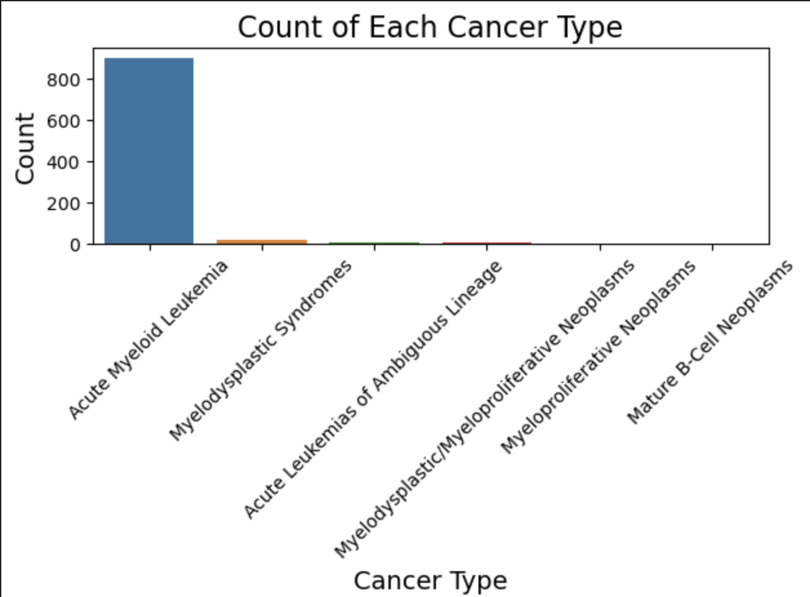
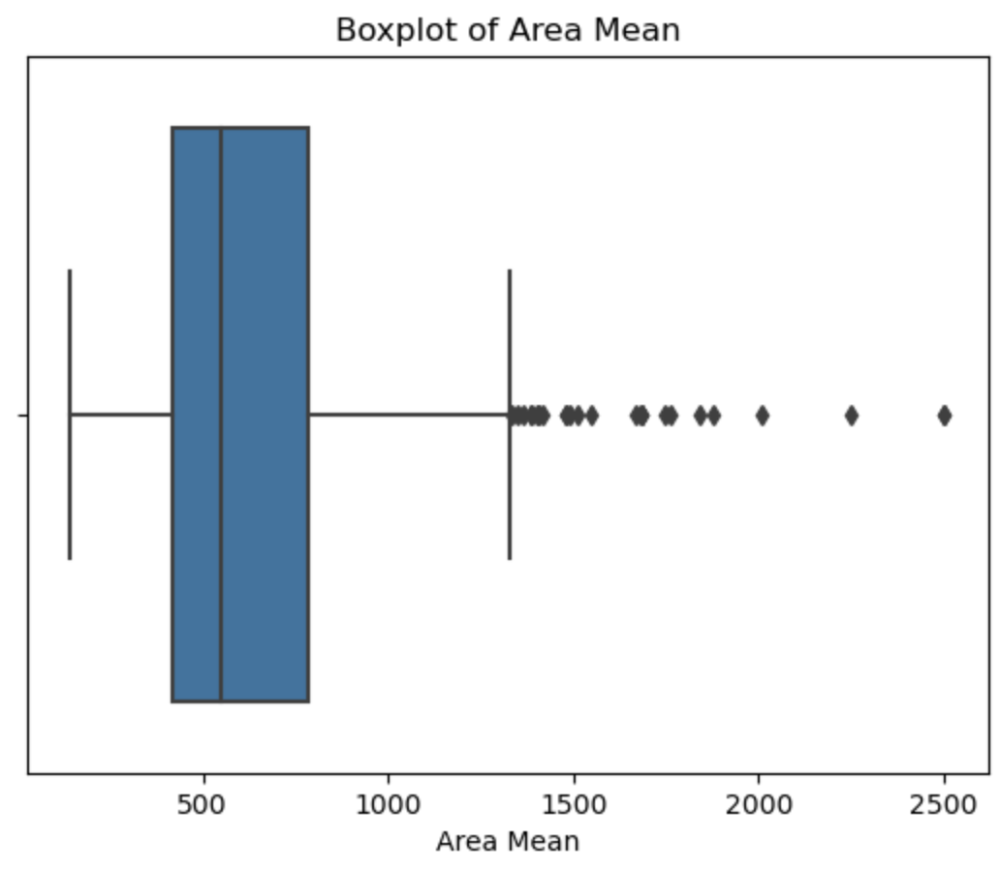
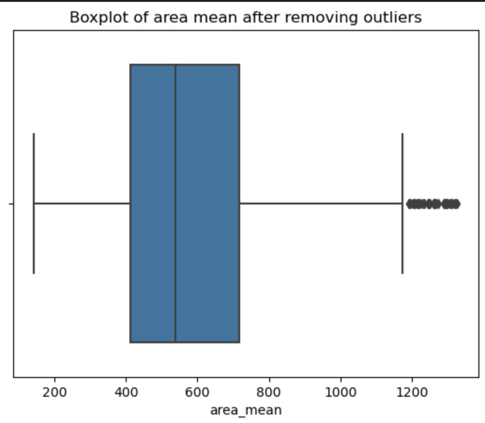
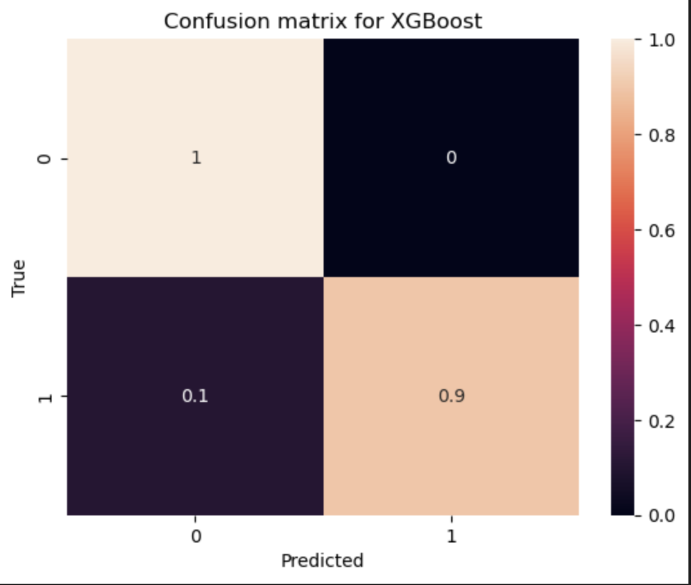
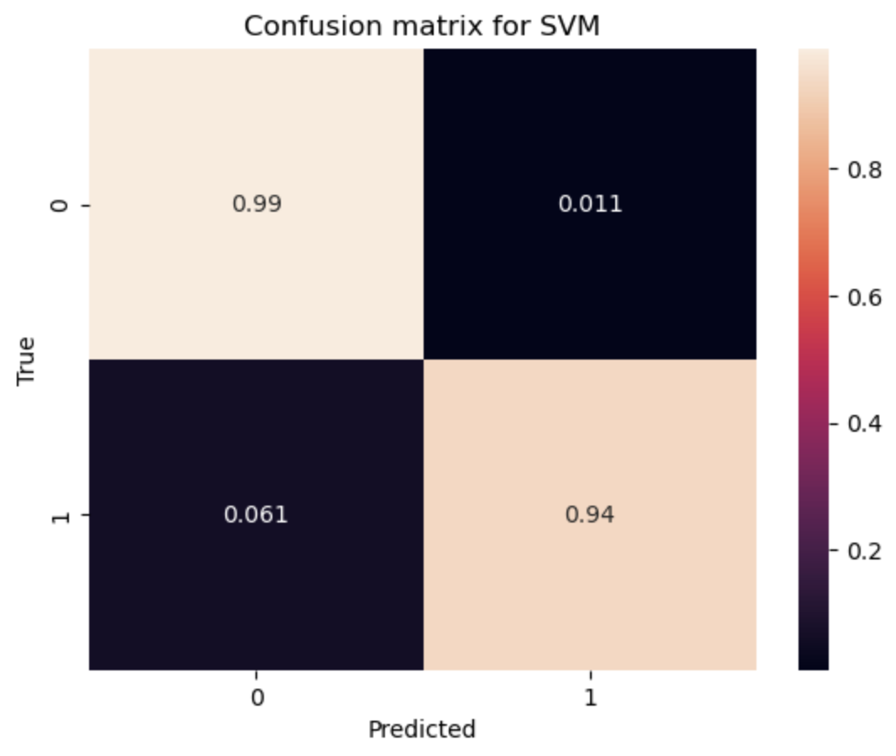

# CAS CS506 Midterm Project
Our final product is a web application through which users are able to get a prediction for the malignancy of their tumor, after inputting information from their fine needle aspirate (FNA). 

## Dataset 
### cBioPortal Dataset

Initially, we were planning on using the cBioPortal Data Acute Myeloid Leukemia set, which included information from many trials, including allele, gene, and white blood cell counts. From this data, we wanted to create and train a model that would best classify the type of cancer based on this information. We started by preprocessing the data: removing unnecessary columns, engineering different features, and creating data visualizations. However, after looking at the data visualizations, we realized that an overwhelming majority of the data set’s cancer type was Acute Myeloid Leukemia, as you can see below. Therefore, we decided it would not be very interesting for us to create and train a model on this data set since simply inferring that any trial would be Acute Myeloid Leukemia would already result in a very high accuracy. 

### NEW Kaggle Dataset

Instead, we decided to pivot and look for another, somewhat related, dataset. After some research, we found a Kaggle Dataset that included information such as tumor size, area, and density. From this information, we hope to train a model that classifies the tumor as benign or malignant based on that information. In this data set, there is a much more evenly distributed split, with 63% benign and 37% malignant tumors, allowing us to better understand how to build a model to classify the data. 

## Preprocessing

### Detect Outliers
Outlier detection is the process of identifying data points that differ significantly from the majority of the data. These outliers can indicate variability in the data, measurement errors, or novel phenomena. Common methods for detecting outliers include using the Interquartile Range (IQR), where you calculate the first quartile (Q1) and the third quartile (Q3) of the data, compute the IQR by subtracting Q1 from Q3, and define the lower quartile as Q1 minus 1.5 times the IQR and the upper quartile as Q3 plus 1.5 times the IQR. Outliers are classified as data points that fall below the lower bound or above the upper bound. Additionally, box plot visualizations can be used to visually identify outliers. Outlier detection is essential for data preprocessing, as outliers can skew results and affect machine learning models' performance. By using methods like IQR, Z-score, visualizations, or machine learning algorithms, we could effectively detect and handle outliers in your dataset.

### Data Normalizing
We import the necessary scalers, select the number columns from the DataFrame numeric_df, and apply the StandardScaler to standardize the numeric features. This transforms the data to have a mean of 0 and a standard deviation of 1, which replaces the original values in the DataFrame. Additionally, there is a commented-out section that shows how to use MinMaxScaler to normalize the numerical features, scaling them to a range between 0 and 1. Finally, it prints the first few rows of the DataFrame after standardization to display the transformed data. In summary, this code preprocesses numeric features by scaling them, which can improve machine learning algorithms' performance.

### Feature Engineering
#### 1. Create a New Feature: Ratio of 'area_mean' to 'radius_mean'
This feature calculates the ratio of the mean area (area_mean) to the mean radius (radius_mean). This ratio can be useful for understanding tumor shape or size.

#### 2. Creating Interaction Features
This feature computes the product of the mean texture (texture_mean) and the mean radius (radius_mean). It represents the interaction between these two variables, which may provide better insights into the tumor characteristics.

#### 3. Mean Features Group Average and Standard Deviation
This step calculates the average (mean_features_avg) and standard deviation (mean_features_std) of several specified mean features. This helps in understanding the overall trends across multiple characteristics.

#### 4. Ratio of 'area_worst' to 'perimeter_worst'
This feature computes the ratio of the worst area (area_worst) to the worst perimeter (perimeter_worst). This can be useful for understanding the tumor shape.

#### 5. Variation between the Worst and Mean Values
For each specified feature, this step calculates the difference between the worst value and the mean value, creating a feature that represents variation. This indicates how much the tumor characteristics vary. This step uses LabelEncoder to convert the categorical feature 'diagnosis' into numerical values. Machine learning models need this preprocessing step to handle categorical data.

## Model Creation

### Splitting the Data
As the first step in our model creation, we split our data into the nexessary X_train, X_test, Y_train, and Y_test using train_test_split() from sklearn, which allows us to preserve the splits of data that we initially stated in our proposal. Then, we used these sets to create our XGBoost and SVC models.

### 1. XGBoost
The first model we created was XGBoost, using sklearn. We wanted to utilize XGBoost as one of our models due to its power and efficiency when it comes ot classification tasks. Additionally, we utilized the acuracy score and confusion matrix functions from sklearn to evaluate how well XGBoost ws classifying the data. With this model, we got an accurayc of around 0.96, also reflected in the confusion matrix, which indicated that XGBoost would be a good model for us to implement in our from-scratch portion.

### 2. SVC
The next model we creater was SVC, using SVM from sklearn. We knew that SVM was a powerful model from class, and that SVC would be the best variations as our task in this poroject is a classification task rather than regression. For this, we also utilized sklearn's accuracy score and confusion matrix functions to evalutae accuracy. For SVC, we ot an accuracy of around 0.97, indicating that SVC was even more accuracte than XGBoost, and also a worthwhile model to implment.

### Video Link: https://youtu.be/xuDXcFzg1y0 

### Next Steps

this is from the midterm: 
As detailed in our original proposal, we will now be implementing these models from scratch. In the case of any time constraints, we will focus on one moddel to implement from scratch, but we are eager to do both XGBoost and SVC. We have many motivations for creating these models from scratch. Firstly, implementing these models from scratch will provide us with a deeper understanding of the algorithms and code behind the models. Then, we will be able to compare the sklearn implementations to our own, to allow us to see what sorts of optimizations sklearn makes and how we can try to incorporate those into our own models. Furthermore, we might even be able to find optimizations in other aspects of the models that sklearn does not do. By creating our models from scratch, we can find opportunities to tailor the models to work better with our data specifically, such as having deeper hyperparameter tuning. Building on the customization, we can adjust the actual algorithms, likw how the decision trees in XGBoost are split, creating custom loss functions, and changing how our models handle imbalanced data. Implementing the models from scratch may also allow us to identify sources of overfitting or underfitting, so that we can try to adjust oour model to prevent this. 
