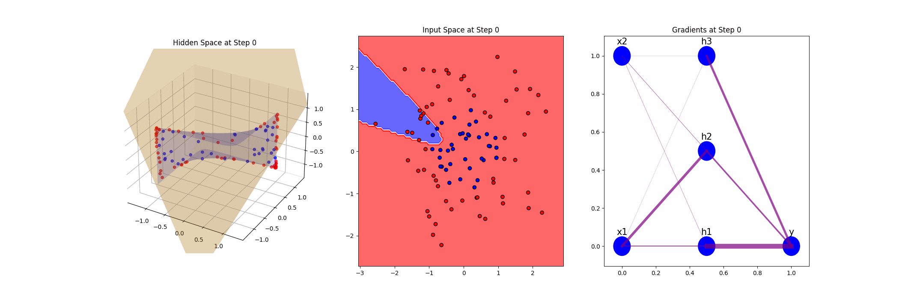

# Assignment 9: Neural Networks

---

In this assignment, you will implement and analyze a simple neural network by visualizing its learned features, decision boundary, and gradients. The goal is to develop a deeper understanding of how a Feedforward Neural Network with one hidden layer operates and represents the input space during learning.

## Task Overview

You are tasked to build and analyze a neural network from scratch with the following specifications:
- **Architecture**: A Feedforward Neural Network with:
  - Input layer: Dimensionality of 2.
  - Hidden layer: 1 hidden layer with 3 neurons.
  - Output layer: Single output for binary classification.
- **Dataset**: A randomly generated 2D dataset with two classes separated by a circular decision boundary.
- **Activation function**: Use a non-linear activation function like ReLU, Sigmoid, or Tanh for the hidden layer.
- **Loss function**: Cross-entropy loss.
- **Optimizer**: Gradient Descent.

You will then visualize and interpret the model’s behavior.


## Part 0: Setup Environment

You can use the `Makefile` to install all dependencies. In your terminal, simply run:

```bash
make install
```

This will automatically install the necessary packages listed in `requirements.txt`, including:

- flask
- numpy
- scikit-learn
- scipy
- matplotlib

## Part 1: Implementing Feedforward Neural Network and Visualization

1. **Build the Feedforward Neural Network**: 
   - Implement the Feedforward Neural Network from scratch with a forward function for forward propagation and a backward function for backpropagation. Implement three activation functions: 'tanh', 'relu', 'sigmoid'.
  
2. **Visualization**
   - Implement the visualization code to plot 
     - The learned features, distorted input space and decision hyperplane in the hidden space
     - The decision boundary in the input space
     - The gradients where the edge thickness visually represents the magnitude of the gradient.
     - Create an animation illustrating the entire training process.

   Here's a basic example of the visualization. It's a simplified version, so feel free to enhance it.
   

  

## Part 2: Testing Your Code with a Static Input (Optional)

1. If you prefer, you can also test the code locally by running the script directly and specifying necessary parameters. 

2. Run the script in your terminal:
   
   python neural_networks.py

3. Check the output in the `results` folder.

## Part 3: Running the Interactive Module

Once the environment is set up, you can start the Flask application by running:

```bash
make run
```

This will start the Flask server and make the interactive application available locally at `http://127.0.0.1:3000`.

1. Open your browser and go to `http://127.0.0.1:3000`.
2. Choose the corresponding parameters and click "Train and Visualize". 
3. The resulting figure will be displayed. It may take a while before the results show up.


## Submission

1. Create a Short Demo Video (1-2 minutes):
   
   - Create a demo video by screen recording your output with your voice-over.
   - Explain any patterns you observe regarding the learned features, decision boundary and gradients.
   - Compare the convergence behavior of the training process for different activation functions.

2. Submit both your completed code and the demo video link.
You can either embed the demo video in your portfolio website or just create an unlisted YouTube video with a link to that YT video in your assignment 9 github repo's readme.

